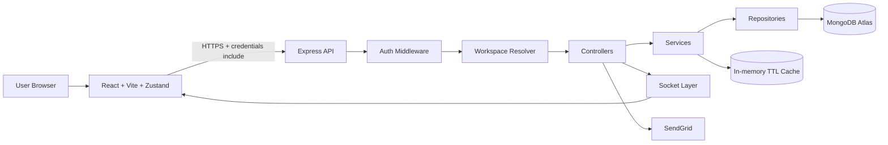

# Ultimate Activity & Task Management Dashboard (SaaS)

[](https://nodejs.org/)
[](https://react.dev/)
[](https://www.mongodb.com/atlas)
[](https://jwt.io/)
[](#license)

Enterprise-grade full-stack SaaS task management platform with secure JWT session architecture, workspace-aware authorization, advanced analytics, and production deployment readiness for Render.

## 🔗 Live Demo
- Frontend: `TBD`
- Backend API: `TBD`

## 🧱 Architecture Overview


## 🧰 Tech Stack
| Layer | Technologies |
|---|---|
| Frontend | React (Vite), Zustand, Tailwind CSS, Recharts, react-window, dnd-kit |
| Backend | Node.js (ESM), Express, Mongoose, MongoDB Atlas |
| Auth & Security | JWT (access + refresh), refresh rotation, tokenVersion invalidation, Helmet, CORS, rate limiting, brute-force lockout |
| Email | SendGrid (`@sendgrid/mail`) |
| Realtime | Socket.IO (WebSocket-ready) |
| Validation & Config | Zod environment validation, fail-fast startup |
| Deployment | Render (Web Service + Static Site) |

## ✅ Features
### Core
- Task lifecycle: create, update, delete, status transitions.
- Multi-view UI: Table, Kanban, Calendar.
- Dashboard: summary cards, completion metrics, charts.
- Cursor-based pagination with backward-compatible offset mode.
- Session-aware auth UI with protected routing.

### Security
- Access token short-lived (memory-only on frontend).
- Refresh token in `httpOnly` secure cookie with rotation.
- Token family/reuse detection and tokenVersion invalidation.
- Login rate limiting + account lock window for brute-force mitigation.
- Strict CORS, Helmet headers, request sanitization, centralized error handling.

### Performance
- Cursor pagination for scalable task reads.
- Compound indexes for hot query paths.
- Aggregation-based stats/analytics with 30s TTL cache.
- Abortable API requests to prevent stale client updates.
- Lazy-loaded heavy frontend modules.

### Advanced
- Session management endpoints (list/revoke device sessions).
- Workspace-aware authorization guard.
- Activity logging and realtime activity/task event pipeline.
- Health (`/health`) and readiness (`/ready`) endpoints for infra probes.

## 🔐 Authentication Architecture
- **Access Token**:
  - Signed JWT, short expiry.
  - Stored only in frontend memory (Zustand session state).
  - Sent via `Authorization: Bearer <token>`.
- **Refresh Token**:
  - Stored in secure `httpOnly` cookie.
  - Cookie config for production cross-site usage:
    - `secure: true`
    - `sameSite: "none"`
    - `httpOnly: true`
  - Rotated on refresh.
- **Session Invalidation**:
  - `tokenVersion` enforced in middleware.
  - Password reset / logout-all invalidates active token families.
- **Session Management**:
  - `GET /api/auth/sessions`
  - `DELETE /api/auth/sessions/:sessionId`

## 🗃 Database Design Overview
### Main collections
- **User**
  - identity, role, auth controls, token version, lock fields, default workspace
- **Workspace**
  - owner + member roles (`Owner`, `Admin`, `Member`, `Viewer`)
- **Task**
  - task payload + ownership (`userId`) + `workspaceId` + lifecycle timestamps
- **RefreshToken**
  - token family, jti, hashed token, expiry/revocation, device metadata
- **Activity**
  - workspace/user scoped activity events and metadata

### Indexing strategy (Task)
- `{ userId: 1, status: 1 }`
- `{ userId: 1, priority: 1 }`
- `{ userId: 1, createdAt: -1 }`
- `{ userId: 1, dueDate: 1 }`
- plus workspace-aware supporting indexes

## 📡 API Overview (Main Endpoints)
### Auth
- `POST /api/auth/register`
- `POST /api/auth/login`
- `POST /api/auth/refresh`
- `GET /api/auth/me`
- `POST /api/auth/logout`
- `POST /api/auth/logout-all`
- `GET /api/auth/sessions`
- `DELETE /api/auth/sessions/:sessionId`
- `POST /api/auth/forgot-password`
- `POST /api/auth/reset-password`

### Tasks
- `POST /api/tasks`
- `GET /api/tasks`
- `GET /api/tasks/stats`
- `PUT /api/tasks/:id`
- `PATCH /api/tasks/:id`
- `DELETE /api/tasks/:id`

### Analytics
- `GET /api/analytics/overview`

### Platform
- `GET /health`
- `GET /ready`

## 🛠 Local Development Setup
### 1) Prerequisites
- Node.js 20+
- npm 10+
- MongoDB Atlas database
- SendGrid API key (for password reset emails)

### 2) Install dependencies
```bash
# frontend root
npm install

# backend
cd server
npm install
cd ..
```

### 3) Configure environment files
```bash
cp server/.env.example server/.env
cp .env.example .env
```

### 4) Run in development
```bash
# from project root
npm run dev:full
```

### 5) Build frontend
```bash
npm run build
```

## ⚙️ Environment Variables
### Backend (`server/.env`)
| Variable | Required | Notes |
|---|---|---|
| `NODE_ENV` | Yes | `production` on Render |
| `PORT` | Yes | Render injects this automatically |
| `MONGODB_URI` | Yes | Atlas connection string |
| `FRONTEND_URL` | Yes | Exact deployed frontend URL |
| `CORS_ORIGIN` | Yes | Keep aligned with `FRONTEND_URL` |
| `JWT_ACCESS_SECRET` | Yes | 32+ chars minimum |
| `JWT_REFRESH_SECRET` | Yes | 32+ chars minimum |
| `JWT_ACCESS_EXPIRES_IN` | Yes | e.g. `15m` |
| `JWT_REFRESH_EXPIRES_IN` | Yes | e.g. `7d` |
| `MAX_LOGIN_ATTEMPTS` | Yes | Brute-force protection |
| `LOGIN_LOCK_MINUTES` | Yes | Account lock duration |
| `TRUST_PROXY` | Yes | `1` on Render |
| `LOG_LEVEL` | Yes | `info` recommended |
| `SENDGRID_API_KEY` | Yes | Reset email integration |
| `EMAIL_FROM` | Yes | Verified sender |
| `APP_NAME` | Yes | Email branding |

### Frontend (`.env.production`)
| Variable | Required | Notes |
|---|---|---|
| `VITE_API_URL` | Yes | `https://<backend>.onrender.com/api` |
| `VITE_SOCKET_URL` | Yes | `https://<backend>.onrender.com` |

## 🚀 Production Deployment Guide (Render)
### Backend (Render Web Service)
1. Create a new **Web Service** from your repo.
2. Set Root Directory to `server`.
3. Build Command: `npm install`
4. Start Command: `npm start`
5. Add backend environment variables from `server/.env.example`.
6. Confirm `TRUST_PROXY=1`, `NODE_ENV=production`.
7. Deploy and validate:
   - `GET https://<backend>/health`
   - `GET https://<backend>/ready`

### Frontend (Render Static Site)
1. Create a new **Static Site** from the same repo.
2. Root Directory: project root.
3. Build Command: `npm install && npm run build`
4. Publish Directory: `dist`
5. Add:
   - `VITE_API_URL=https://<backend>.onrender.com/api`
   - `VITE_SOCKET_URL=https://<backend>.onrender.com`
6. Deploy.

### Final production wiring
1. Set backend `FRONTEND_URL` to the deployed frontend URL.
2. Set backend `CORS_ORIGIN` to the same frontend URL.
3. Redeploy backend after env changes.
4. Verify login + refresh cookie + protected route access in browser.

## 🔒 Security Highlights
- Refresh token never exposed to JavaScript.
- Token rotation + reuse handling.
- TokenVersion-based session invalidation.
- Workspace/user isolation enforced server-side.
- Zod env validation with fail-fast startup.
- Strict CORS origin checking.
- Helmet headers + rate limiting + login lockout.

## ⚡ Performance Optimizations
- Cursor pagination for task listing scalability.
- Mongo aggregation for metrics and analytics.
- 30-second TTL cache for expensive dashboard queries.
- Compound indexes for common filters/sorts.
- Client request cancellation with `AbortController`.
- Lazy loading for analytics and view modules.

## 📁 Folder Structure
```text
.
├─ src/
│  ├─ api/
│  ├─ components/
│  │  ├─ dashboard/
│  │  ├─ views/
│  │  ├─ metrics/
│  │  ├─ auth/
│  │  └─ ...
│  ├─ hooks/
│  ├─ store/
│  └─ utils/
├─ server/
│  ├─ config/
│  ├─ controllers/
│  ├─ middleware/
│  ├─ models/
│  ├─ realtime/
│  ├─ repositories/
│  ├─ routes/
│  ├─ services/
│  └─ utils/
├─ docker-compose.yml
├─ docker-compose.dev.yml
└─ README.md
```

## 🛣 Future Roadmap
- Workspace invitations and member onboarding flows.
- Role-specific admin dashboard screens.
- Background job queue for emails/analytics precomputation.
- Optional Redis cache layer for horizontal scaling.
- End-to-end test suite and CI/CD quality gates.

## 🤝 Contribution Guidelines
1. Fork the repository.
2. Create a feature branch (`feature/<name>`).
3. Keep changes modular (route → middleware → service → repository).
4. Add tests where behavior changes.
5. Open a PR with a clear summary and validation notes.

## License
This repository currently does not include a license file.  
Until a license is added, usage is restricted by default copyright.

## Author
**Sumit Jagtap**  
Portfolio: [sumitjagtap.vercel.app](https://sumitjagtap.vercel.app)

# THis-TO-DO-APP-
